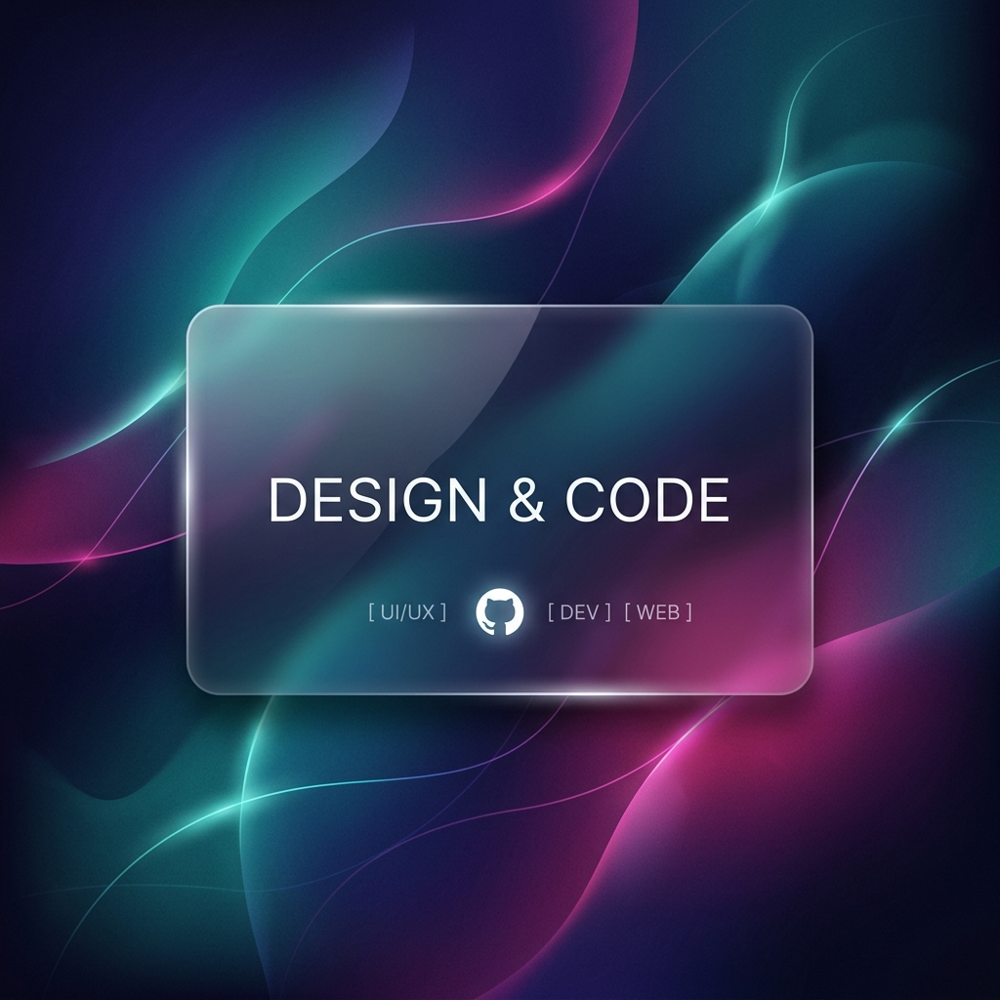

<!--
  ✨ GORGEOUS & CREATIVE PROFILE README ✨
-->

  <!-- Typing SVG header: modern sans font, cyan/violet tones -->
  

  <!-- Profile Banner Image (automatically centered, high-res) -->
  

  

    <strong>Form follows function. Interface demands magic. ✨</strong>
  

  

    <!-- Quick status badges -->
    
    
    
  

---

### 💫 About Me

I am a **Creative Developer** blending technical architecture with modern design aesthetics. I build responsive frontends, scalable APIs, and love experimenting with new web technologies.

- 🔭 **Current Focus:** Creating beautiful, interactive interfaces and studying modern UX design.
- 🚀 **Learning:** Advanced React/NextJS patterns, WebGL/Three.js, and Generative AI tools.
- 🎨 **Design Ethos:** Simple interfaces, rich details, smooth animations, and solid accessibility.
- 💬 **Ask Me About:** JavaScript/TypeScript, React state management, design systems, and frontend optimization.
- ✉️ **Reach Out:** Drop me an email at **kritin006@gmail.com** or connect with me via the social links below!

---

### 🛠️ Tech Stack & Toolkit

Here are the tools and technologies I use to bring ideas to life:

<table>
  <tr>
    <td valign="top" width="33%">
      <strong>Frontend & Design</strong>
        
      
      
       
      
      
       
      
      
       
      
      
    </td>
    <td valign="top" width="33%">
      <strong>Backend & Infrastructure</strong>
        
      
      
       
      
      
       
      
      
    </td>
    <td valign="top" width="33%">
      <strong>Tools & Workflow</strong>
        
      
      
       
      
      
       
      
      
    </td>
  </tr>
</table>

---

### 📊 GitHub Analytics

Here is a live look at my developer activity and programming statistics. These cards update automatically!

  <table border="0">
    <tr>
      <td align="center" valign="middle">
        
      </td>
      <td align="center" valign="middle">
        
      </td>
    </tr>
  </table>
  
   

  <!-- GitHub Streak Card -->
  

---

### 🤝 Connect With Me

Let's collaborate, talk shop, or discuss creative code:

  
  
  
  

   
  
  

    Designed with ❤️ | Updated automatically via GitHub API
  

